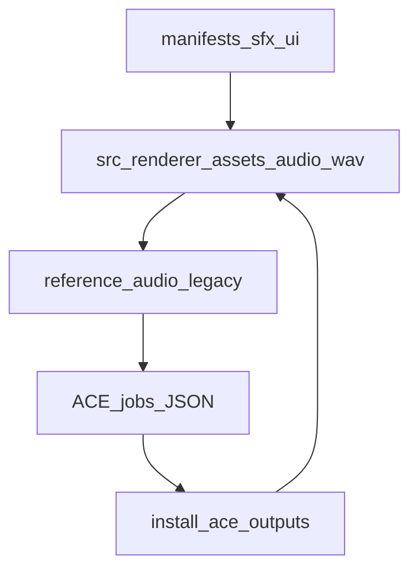

# Memory Dungeon — audio asset inventory

Ultra-deep catalog of **all shipped WAV roles** (29 targets): runtime triggers, Memory Dungeon style intent, ACE batch **duration** (ffmpeg trim window via [`install-ace-app-outputs.mjs`](../scripts/audio-pipeline/install-ace-app-outputs.mjs)), **reference** legacy filenames, **materialize** sources, and **procedural** fallbacks.

For end-to-end wiring, see [AUDIO_INTEGRATION.md](./AUDIO_INTEGRATION.md).

## Contents

- [How references relate to shipped assets](#how-references-relate-to-shipped-assets)
- [Authoritative code and data](#authoritative-code-and-data)
- [Gameplay one-shots (16)](#gameplay-one-shots-16)
- [UI / menu one-shots (11)](#ui--menu-one-shots-11)
- [Music loops (2)](#music-loops-2)
- [ACE prompts, coverage, and tooling](#ace-prompts-coverage-and-tooling)
- [Reference coupling summary](#reference-coupling-summary)

## How references relate to shipped assets

[`materialize-reference-audio.mjs`](../scripts/audio-pipeline/materialize-reference-audio.mjs) now copies the exact legacy basenames required by [`jobs.memory-dungeon-app-audio.json`](../scripts/audio-pipeline/jobs.memory-dungeon-app-audio.json) **from** `src/renderer/assets/audio/dont_modify/` **into** `scripts/audio-pipeline/reference-audio/`.

That breaks the earlier self-referential loop where shipped/generated assets became the next batch's references. Current generation anchors should be treated as stable legacy texture guides until the `dont_modify` pack changes or a licensed replacement pack is installed through [`materialize-reference-audio-from-pack.mjs`](../scripts/audio-pipeline/materialize-reference-audio-from-pack.mjs).

## Authoritative code and data

| Concern | Location |
|--------|----------|
| Integration overview | [AUDIO_INTEGRATION.md](./AUDIO_INTEGRATION.md) |
| Gameplay sampled + procedural | [`sampledSfx.ts`](../src/renderer/audio/sampledSfx.ts), [`gameSfx.ts`](../src/renderer/audio/gameSfx.ts) |
| UI sampled + procedural | [`uiSfx.ts`](../src/renderer/audio/uiSfx.ts) |
| Menu / run music loops | [`gameplayMusic.ts`](../src/renderer/audio/gameplayMusic.ts) |
| Gameplay manifest | [`sfx/manifest.json`](../src/renderer/assets/audio/sfx/manifest.json) |
| UI manifest | [`ui/manifest.json`](../src/renderer/assets/audio/ui/manifest.json) |
| ACE jobs (caption, duration, `reference_audio`, `audio_cover_strength`) | [`jobs.memory-dungeon-app-audio.json`](../scripts/audio-pipeline/jobs.memory-dungeon-app-audio.json) |
| Install map (job id → final path) | [`install-ace-app-outputs.mjs`](../scripts/audio-pipeline/install-ace-app-outputs.mjs) |
| Stub map (legacy name → source asset) | [`materialize-reference-audio.mjs`](../scripts/audio-pipeline/materialize-reference-audio.mjs) (`REFERENCE_STUB_MAP`) |

## Gameplay one-shots (16)

Directory: `src/renderer/assets/audio/sfx/`

| Key (manifest) | File | ACE `id` | Trigger | Style / role | ACE `duration` (s) | `reference_audio` (legacy) | Materialize source (`REFERENCE_STUB_MAP`) | Procedural fallback ([`gameSfx.ts`](../src/renderer/audio/gameSfx.ts)) |
|----------------|------|----------|---------|--------------|-------------------|-----------------------------|------------------------------------------|-----------------------------------------------------------------------|
| `flip` | `flip.wav` | `flip` | `playFlipSfx` (tile flip) | Vault wood/tile tick; single transient | 4 | `Hit_WoodenFlap.wav` | `src/renderer/assets/audio/sfx/flip.wav` | Sine 520 Hz, ~50 ms |
| `gambitCommit` | `gambit-commit.wav` | `gambit-commit` | `playGambitCommitSfx` (3rd gambit flip) | Short upward glassy commit | 5 | `ATARI.wav` | `src/renderer/assets/audio/sfx/gambit-commit.wav` | Sine 880→1120 Hz, ~68 ms |
| `match-tier-low` | `match-tier-low.wav` | `match-tier-low` | `playMatchSfx`, streak 1–5 (`matchTierDepthRanges`) | Low-tier match bloom | 5 | `Extra_Life_Blob.wav` | `src/renderer/assets/audio/sfx/match-tier-low.wav` | Triangle ramp ~612–820+ Hz, duration scales with chain |
| `match-tier-mid` | `match-tier-mid.wav` | `match-tier-mid` | `playMatchSfx`, streak 6–10 | Mid checkpoint warmth | 6 | `Misc_Checkpoint.wav` | `src/renderer/assets/audio/sfx/match-tier-mid.wav` | Same tier ramp, deeper chain |
| `match-tier-high` | `match-tier-high.wav` | `match-tier-high` | `playMatchSfx`, streak 11–14 | High triumph sting | 7 | `Misc_StartLevel.wav` | `src/renderer/assets/audio/sfx/match-tier-high.wav` | Same tier ramp |
| `mismatch` | `mismatch.wav` | `mismatch` | `playResolveSfx` on failed pair | Soft wrong-pair / papery down | 5 | `Hit_Paper.wav` | `src/renderer/assets/audio/sfx/mismatch.wav` | Saw 180→120 Hz, ~180 ms |
| `power-arm` | `power-arm.wav` | `power-arm` | `playPowerArmSfx` | Arm power chirp | 5 | `Misc_Trafo.wav` | `src/renderer/assets/audio/sfx/power-arm.wav` | Sine 392→556 Hz, ~70 ms |
| `destroy-pair` | `destroy-pair.wav` | `destroy-pair` | `playDestroyPairSfx` | Heavy crumble | 7 | `Hit_Stone_Kuppel.wav` | `src/renderer/assets/audio/sfx/destroy-pair.wav` | Saw 132→88 Hz, ~220 ms |
| `peek-power` | `peek-power.wav` | `peek-power` | `playPeekPowerSfx` | Airy reveal lift | 5 | `Misc_UFO_anim.wav` | `src/renderer/assets/audio/sfx/peek-power.wav` | Sine 1040→1380 Hz, ~100 ms |
| `stray-power` | `stray-power.wav` | `stray-power` | `playStrayPowerSfx` | Quick scrape dismiss | 5 | `Misc_RopeTears.wav` | `src/renderer/assets/audio/sfx/stray-power.wav` | Triangle 380→240 Hz, ~140 ms |
| `shuffle-full` | `shuffle-full.wav` | `shuffle-full` | `playShuffleSfx(false)` | Full shuffle sweep | 7 | `Roll_Wood_Stone.wav` | `src/renderer/assets/audio/sfx/shuffle-full.wav` | Layered saw + triangle sweep |
| `shuffle-quick` | `shuffle-quick.wav` | `shuffle-quick` | `playShuffleSfx(true)` | Reduce-motion tick | 4 | `Pieces_Stone.wav` | `src/renderer/assets/audio/sfx/shuffle-quick.wav` | Sine 440 Hz, ~42 ms |
| `floor-clear` | `floor-clear.wav` | `floor-clear` | `playFloorClearSfx` (deferred macrotask) | Floor clear flourish | 7 | `Misc_StartLevel.wav` | **`src/renderer/assets/audio/sfx/match-tier-high.wav`** (same legacy ref as high-tier match) | Sine 300→1080 Hz, ~200 ms |

Additional gameplay cues in the 29-target batch:

| Key | File | ACE `id` | Trigger | Style / role | ACE `duration` (s) | `reference_audio` |
|-----|------|----------|---------|--------------|-------------------|-------------------|
| `relic-offer-open` | `relic-offer-open.wav` | `relic-offer-open` | `GameScreen` relic-offer transition | Mystical reveal swell | 5 | `Misc_UFO_anim.wav` |
| `relic-pick` | `relic-pick.wav` | `relic-pick` | `useAppStore.pickRelic` | Warm reward bloom | 4 | `Extra_Life_Blob.wav` |
| `wager-arm` | `wager-arm.wav` | `wager-arm` | `useAppStore.acceptEndlessRiskWager` | Tense upward spark | 4 | `Misc_Lightning.wav` |

**Coupling:** `floor-clear` and `match-tier-high` still share **`Misc_StartLevel.wav`**, but references now come from `dont_modify` instead of generated shipped assets.

## UI / menu one-shots (11)

Directory: `src/renderer/assets/audio/ui/`

| Key | File | ACE `id` | Trigger | Style / role | ACE `duration` (s) | `reference_audio` | Materialize source | Procedural fallback ([`uiSfx.ts`](../src/renderer/audio/uiSfx.ts)) |
|-----|------|----------|---------|--------------|-------------------|-------------------|-------------------|-------------------------------------------------------------------|
| `ui-click` | `ui-click.wav` | `ui-click` | `playUiClickSfx` (menus, codex, settings, choose-path, etc.) | Dry marble UI tap | 3 | `Pieces_Stone.wav` | **`src/renderer/assets/audio/sfx/shuffle-quick.wav`** | Sine 620 Hz, ~40 ms |
| `ui-confirm` | `ui-confirm.wav` | `ui-confirm` | `playUiConfirmSfx` (accept / save) | Soft affirmative ping | 3 | `Extra_Life_Blob.wav` | **`src/renderer/assets/audio/sfx/match-tier-low.wav`** (shared with `match-tier-low` job ref) | Triangle 520→760 Hz, ~90 ms |
| `ui-back` | `ui-back.wav` | `ui-back` | `playUiBackSfx` | Soft cancel / down tap | 3 | `Hit_Wood_Wood.wav` | **`src/renderer/assets/audio/sfx/mismatch.wav`** | Sine 360→240 Hz, ~80 ms |
| `ui-counter` | `ui-counter.wav` | `ui-counter` | **`playUiCounterSfx` — no call sites in components (only exported)** | Tiny counter tick | 2 | `Pieces_Stone.wav` | **`src/renderer/assets/audio/sfx/shuffle-quick.wav`** (shared with `ui-click` ref path) | Sine 860 Hz, ~35 ms |
| `menu-open` | `menu-open.wav` | `menu-open` | `playMenuOpenSfx` (main menu / meta navigation) | Panel open whoosh | 4 | `Misc_Checkpoint.wav` | **`src/renderer/assets/audio/sfx/match-tier-mid.wav`** (shared with `match-tier-mid` job ref) | Triangle 280→540 Hz, ~160 ms |
| `run-start` | `run-start.wav` | `run-start` | `playRunStartSfx` (`useAppStore` run / restart paths) | Run begin sting | 4 | `ATARI.wav` | **`src/renderer/assets/audio/sfx/gambit-commit.wav`** (shared with `gambit-commit` job ref) | Triangle 220→620 Hz, ~220 ms |

Additional UI/meta cues in the 29-target batch:

| Key | File | ACE `id` | Trigger | Style / role | ACE `duration` (s) | `reference_audio` |
|-----|------|----------|---------|--------------|-------------------|-------------------|
| `intro-sting` | `intro-sting.wav` | `intro-sting` | `StartupIntro.completeIntro` | Startup ceremonial sting | 4 | `Menu_load.wav` |
| `pause-open` | `pause-open.wav` | `pause-open` | `useAppStore.pause` | Suspend chime | 3 | `Menu_dong.wav` |
| `pause-resume` | `pause-resume.wav` | `pause-resume` | `useAppStore.resume` | Resume release ping | 3 | `Misc_Checkpoint.wav` |
| `game-over-open` | `game-over-open.wav` | `game-over-open` | `GameOverScreen` mount | Somber downward close | 4 | `Misc_Fall.wav` |
| `ui-copy` | `ui-copy.wav` | `ui-copy` | Copy/export success | Bright archive tick | 2 | `Menu_counter.wav` |

`ui-counter` is now used for semantic settings ticks and meditation mutator toggles; the full screen-level interaction map lives in [AUDIO_INTERACTION_MATRIX.md](./AUDIO_INTERACTION_MATRIX.md).

## Music loops (2)

Directory: `src/renderer/assets/audio/music/`

| File | ACE `id` | Trigger | Style / role | ACE `duration` (s) | `reference_audio` | Materialize source | Playback |
|------|----------|---------|--------------|-------------------|-------------------|-------------------|----------|
| `menu-loop.wav` | `menu-loop` | [`gameplayMusic.ts`](../src/renderer/audio/gameplayMusic.ts) when `visualView === 'menu'` | Hub loop: cold marble, sparse, loopable | 30 | `Menu_atmo.wav` | `src/renderer/assets/audio/music/menu-loop.wav` | `HTMLAudioElement` loop; seam quality is an authoring concern |
| `run-loop.wav` | `run-loop` | same hook when `visualView === 'playing'` | Run tension bed | 30 | `Music_thunder.wav` | `src/renderer/assets/audio/music/run-loop.wav` | `HTMLAudioElement` loop |

Gain: `masterVolume * musicVolume`. Unlike SFX, loops are not decoded through the same buffer pipeline as [`sampledSfx.ts`](../src/renderer/audio/sampledSfx.ts).

## ACE prompts, coverage, and tooling

- **Full text prompts:** each job’s `caption` in [`jobs.memory-dungeon-app-audio.json`](../scripts/audio-pipeline/jobs.memory-dungeon-app-audio.json) (Memory Dungeon vault / crystalline marble-glass brief + per-event constraints).
- **Style seeds:** [`PROMPTS.md`](../scripts/audio-pipeline/PROMPTS.md) (including the “Full app batch” section).
- **Alternate legacy names per event:** `referenceSourceCoverage` in the same jobs file; use with [`apply-reference-coverage-priority.mjs`](../scripts/audio-pipeline/apply-reference-coverage-priority.mjs) after populating `reference-audio/` from a pack.

## Reference coupling summary

Legacy files that **duplicate the same materialize source file** (same bytes into `reference-audio/`):

| Materialize source (one file) | Legacy names written to `reference-audio/` |
|-------------------------------|---------------------------------------------|
| `sfx/mismatch.wav` | `Hit_Paper.wav`, `Hit_Wood_Wood.wav` |
| `sfx/shuffle-quick.wav` | `Pieces_Stone.wav`, `Menu_counter.wav` |
| `sfx/match-tier-low.wav` | `Extra_Life_Blob.wav`, `Menu_dong.wav` |
| `sfx/flip.wav` | `Hit_WoodenFlap.wav`, `Menu_click.wav` |
| `sfx/gambit-commit.wav` | `ATARI.wav`, `Extra_Start.wav` |

Jobs that **share the same `reference_audio` basename** (same timbre anchor file):

- `Misc_StartLevel.wav`: `match-tier-high`, `floor-clear`
- `Pieces_Stone.wav`: `ui-click`, `ui-counter`, `shuffle-quick` (job ref)
- `Misc_Checkpoint.wav`: `match-tier-mid`, `menu-open`
- `ATARI.wav`: `gambit-commit`, `run-start`
- `Extra_Life_Blob.wav`: `match-tier-low`, `ui-confirm`

