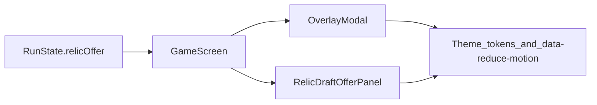

# UI ultra-refinement (relic draft)

**Delivery:** RDUI-001–RDUI-008 are **shipped** in the repo (per-phase task cards under [`tasks/`](./tasks/)); optional Playwright for the overlay remains deferred per RDUI-008.

**Scope:** Presentation layer only—how the milestone relic draft *reads* and *feels* in-game. Gameplay, weights, and bonus-pick math stay covered by [Visual language](./01-visual-language.md), [State machine](./02-state-machine.md), and [Bonus sources](./03-bonus-sources.md). This doc is the execution roadmap until the draft moment matches the quality bar of the rest of the shell.

## North star

The relic draft should land as a **premium, readable milestone beat**: tier and rarity are legible at a glance **without** noisy on-card prefixes; multi-pick visits stay **unambiguous** (how many choices remain, that options **reroll** between rounds); motion supports hierarchy and feedback under **`[data-reduce-motion='false']`** and falls back to static chrome when reduced; keyboard and screen-reader users get predictable focus and announcements. Today the flow is still closer to a **generic modal with three buttons** than to that bar—this epic closes the gap.

## Current-state snapshot

**Files involved**

| Layer | Files |
|--------|--------|
| Shell | [`GameScreen.tsx`](../../../src/renderer/components/GameScreen.tsx) — `OverlayModal` when `run.relicOffer`, title/subtitle via `getRelicOfferTitle` / `getRelicOfferSubtitle`, [`RELIC_LABELS`](../../../src/renderer/components/GameScreen.tsx) |
| Modal | [`OverlayModal.tsx`](../../../src/renderer/components/OverlayModal.tsx), [`OverlayModal.module.css`](../../../src/renderer/components/OverlayModal.module.css) — `headerPlateTone="relic"`, body-only layout note for empty action column |
| Draft body | [`RelicDraftOfferPanel.tsx`](../../../src/renderer/components/RelicDraftOfferPanel.tsx), [`RelicDraftOffer.module.css`](../../../src/renderer/components/RelicDraftOffer.module.css) |

**Already aligned with [01-visual-language](./01-visual-language.md)**

- Rarity → CSS classes (`card_common` / `card_uncommon` / `card_rare`), rune strip pattern per tier, rare border weight 2px.
- Visible card body is **effect-only**; `aria-label` uses `relicDraftRarityLabel` for explicit tier wording.
- Rare sheen animation gated behind `:global([data-reduce-motion='false'])`; static when reduced.

**Still “shell” / thin**

- Header + subtitle are a **dense text wall**; progress across multi-pick is only implied by the title string, not a dedicated progress line or chip.
- No **round affordance** (`pickRound`) beyond what players infer after clicking—no “new choices” cue for SR users beyond implicit DOM swap.
- No **staggered entrance**, **pressed/active** affordance beyond hover/focus, or **inter-round** transition story.
- **Bonus provenance** (why do I have 3 picks?) is not surfaced when stacked bonuses apply—see [03-bonus-sources](./03-bonus-sources.md)—players rely on memory or menu context.
- **Relic identity parity** with Collection/Inventory is uneven; see cross-link below.

**Cross-link: meta screens**

[`docs/refinement-tasks/REF-015.md`](../../refinement-tasks/REF-015.md) tracks Collection vs Inventory metaphors for relic identity. Ultra-refinement here should **not** silently fork “what a relic looks like” in a third way—prefer shared typography tokens or a shared row/card primitive when implementing P2, or explicitly document the intentional difference.

## Gap matrix (player need → system knob → UI gap)

| Player need | System knob | UI gap today |
|-------------|-------------|----------------|
| Know how many picks this visit | `relicOffer.picksRemaining` | Only reflected in title/subtitle length; no compact chip or stepper |
| Know this is round 2+ (new roll) | `relicOffer.pickRound` | Not shown; no live region when options replace |
| Trust tier without reading | `RelicDraftRarity` + CSS | Baseline OK; could strengthen pattern density / spacing per [01](./01-visual-language.md) |
| Understand *why* extra picks | `bonusRelicPicksNextOffer`, contracts, meta, mutators | Not surfaced in overlay |
| Pick with keyboard | Three `<button>`s in DOM order | No arrow roving; focus after pick not specified |
| Pause / shortcut clarity | `run.relicOffer` blocks pause UX | Must stay consistent with [`REF-010`](../../refinement-tasks/REF-010.md) |

## Phased work (pillars)

Each phase has **acceptance criteria** you can check off during implementation.

### Task files

Per-phase specs (Problem, Proposed work, Files, Acceptance): [`tasks/README.md`](./tasks/README.md).

| Phase | Task file |
|-------|-----------|
| P1 | [`tasks/RDUI-001.md`](./tasks/RDUI-001.md) |
| P2 | [`tasks/RDUI-002.md`](./tasks/RDUI-002.md) |
| P3 | [`tasks/RDUI-003.md`](./tasks/RDUI-003.md) |
| P4 | [`tasks/RDUI-004.md`](./tasks/RDUI-004.md) |
| P5 | [`tasks/RDUI-005.md`](./tasks/RDUI-005.md) |
| P6 | [`tasks/RDUI-006.md`](./tasks/RDUI-006.md) |
| P7 | [`tasks/RDUI-007.md`](./tasks/RDUI-007.md) |
| P8 | [`tasks/RDUI-008.md`](./tasks/RDUI-008.md) |

### P1 — Information architecture

- **Progress:** A single scannable line or chip, e.g. “Pick **2** of **3** this visit” or “**2** choices remaining,” derived from `picksRemaining` (and total visit budget if exposed to UI—otherwise infer from initial budget if stored or compute display-only).
- **Header/subtitle:** Shorten or split: title names the **draft tier** and visit; subtitle explains **immediate apply** + **reroll between picks** in one or two short sentences max.
- **Optional bonus row:** When `bonusRelicPicksNextOffer` was consumed or Scholar / meta applies, a **small non-noisy** chip row (or footnote) pointing to *why* extra picks exist—tie to [03-bonus-sources](./03-bonus-sources.md); do not duplicate formulas.

**Acceptance:** A new player with multi-pick can state how many picks remain without reading the long subtitle; bonus provenance is optional but not misleading.

### P2 — Card presentation

- Strengthen tier read per [01](./01-visual-language.md): border weight, glow, rune strip **density**, optional **compact vs comfort** density (phone vs wide) via CSS modules / container queries if used elsewhere in the project.
- **No** visible “Rare ·” prefix on the card face; optional `sr-only` duplicate only if it improves parity with `aria-label` (avoid triple announcement).

**Acceptance:** Side-by-side screenshot: common / uncommon / rare are distinguishable with color **simulated** to grayscale (patterns + weight still differ).

### P3 — Multi-pick flow

- After `onPick`, when the offer **stays open** with new `options`: move **focus** to the first new card (or announce first card id); avoid focus loss on the removed button.
- **Live region:** polite announcement when `pickRound` increments, e.g. “New relic choices” or “Round two—three new options,” aligned with [`useHudPoliteLiveAnnouncement`](../../../src/renderer/hooks/useHudPoliteLiveAnnouncement.ts) patterns if reused.

**Acceptance:** VoiceOver/NVDA: multi-pick visit announces round change; focus is never stuck on a removed node.

### P4 — Motion

- **Entrance:** Stagger card appearance under `[data-reduce-motion='false']` only; instant or fade-only when reduced.
- **Interaction:** `:active` / press state on cards; optional micro-scale within accessibility comfort.
- **No** new looping motion on common/uncommon unless justified; rare sheen stays as today.

**Acceptance:** With reduce motion **on**, no stagger and no new animations beyond existing rare sheen off-state.

### P5 — Responsive

- Preserve **body-only** modal layout (no empty action column)—see comment in [`OverlayModal.module.css`](../../../src/renderer/components/OverlayModal.module.css).
- Grid: `minmax` / gap tuned for **narrow landscape** and **phone**; cap max width on ultra-wide so cards do not stretch into unreadable lines.
- Safe-area: if gameplay shell already insets modals, match that pattern.

**Acceptance:** Visual pass at breakpoints used in [`breakpoints.ts`](../../../src/renderer/breakpoints.ts) / project standards; no horizontal scroll in draft body.

### P6 — Input

- **Arrow keys** or **roving tabindex** between the three options while overlay is open.
- **Escape:** only if product allows closing draft without picking (likely **no**—document **no-dismiss** behavior explicitly so QA does not file a false bug).
- Re-read [`REF-010`](../../refinement-tasks/REF-010.md): `P` / pause behavior when `relicOffer` is active must remain **defined and tested**; keyboard work must not steal keys from global handlers.

**Acceptance:** Keyboard-only user can move focus across options and activate with Enter/Space; behavior matches documented matrix.

### P7 — Copy centralization

- Relic offer **titles, subtitles, chip strings**, and **`RELIC_LABELS`-class copy** for the draft panel should live in a dedicated module, e.g. `src/renderer/copy/relicDraftOffer.ts` (alongside [`gameOverScreen.ts`](../../../src/renderer/copy/gameOverScreen.ts), [`inventoryScreen.ts`](../../../src/renderer/copy/inventoryScreen.ts)), consumed by `GameScreen` / panel props.

**Acceptance:** No long user-facing strings for this flow remain inline in `GameScreen.tsx` except re-exports or one-line wiring.

### P8 — QA

- **Manual:** Checklist—single pick, multi-pick (2+), all three rarities visible, reduce motion on/off, narrow phone, wide desktop, screen reader round-trip.
- **Optional automation:** Playwright assertion on `data-testid="game-relic-offer-overlay"` + card count—defer if flaky; not required for epic closure.

**Acceptance:** Checklist exists in this repo (could live as a subsection below or in `e2e/README.md` cross-link) and is run before shipping the UI tranche.

## QA checklist (manual)

Run before merging relic-draft UI changes. Delegation map: [`tasks/EXPLICIT_50_RDUI_AGENTS.md`](./tasks/EXPLICIT_50_RDUI_AGENTS.md).

- [ ] **Single-pick:** Progress line hidden; single-pick subtitle; choosing a relic closes the overlay and advances.
- [ ] **Multi-pick (2+):** Progress shows “Pick X of Y”; after a pick, options reroll; focus moves to the first new card; polite live region announces new choices (screen reader).
- [ ] **Bonus footnotes:** Shown only when the visit has extra picks and a source applies (Scholar, meta, Daily, Generous Shrine)—copy stays non-technical.
- [ ] **Rarity:** Common / uncommon / rare read clearly; optional grayscale pass (patterns + border weight).
- [ ] **Reduce motion on:** No staggered card entrance; existing rare sheen rules unchanged.
- [ ] **Keyboard:** ArrowLeft/ArrowRight (wrap), Home/End, Enter/Space; **P** does not pause during draft ([`REF-010`](../../refinement-tasks/REF-010.md)); Escape does not dismiss the draft.
- [ ] **Responsive:** Narrow phone and wide desktop—no horizontal scroll in draft body; layout stays readable.
- [ ] **Optional Playwright:** Assert `data-testid="game-relic-offer-overlay"` + button count—defer if flaky; see [`e2e/README.md`](../../e2e/README.md).

## Non-goals

- Balance tuning, weight curves, or new relic IDs.
- Endless-floor slot behavior for `generous_shrine` beyond what [03](./03-bonus-sources.md) already describes.
- Full **i18n** (strings centralized in P7 are still English-first unless a separate i18n epic lands).
- Rewriting Collection/Codex/Inventory screens—only **parity awareness** via REF-015.

## Dependencies

## Related

- [Visual language](./01-visual-language.md)
- [State machine](./02-state-machine.md)
- [Bonus sources](./03-bonus-sources.md)
- [`REF-010`](../../refinement-tasks/REF-010.md) — pause / overlay interaction matrix
- [`REF-015`](../../refinement-tasks/REF-015.md) — relic identity across meta screens
