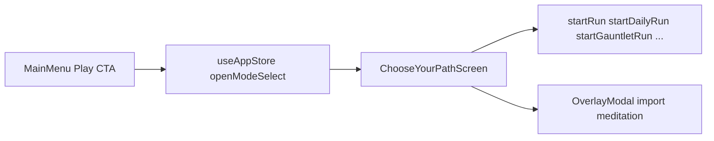
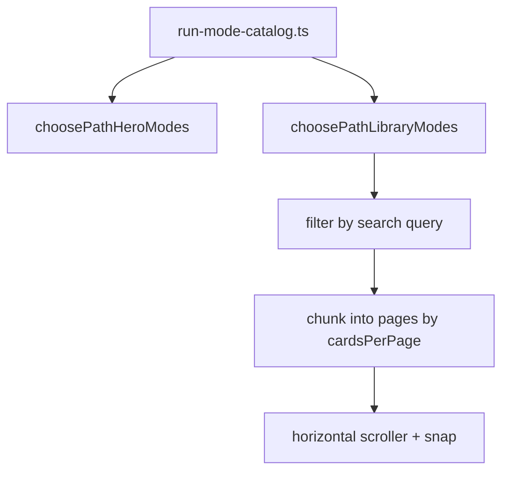

# Epic: Choose Your Path (mode selection shell)

**Audience:** engineers and designers working on meta navigation, mode entry, or visual polish.

**Revision:** This doc is the **authoritative shell spec** for Choose Your Path. *Second pass (code review, 2026-04):* expanded layout/zoom pipeline, pager math, state inventory, CSS-anchored audit notes, and QA matrix. *Third pass (2026-04):* library toolbar + tray polish, edge fades, `data-poster-key` tints, doc sync. *Fourth pass (2026-04):* **touch- and pointer-first** library chrome — collapsible search (magnifier), no Previous/Next chrome, drag/swipe primary; doc sync across gameplay epics. *Fifth pass (2026-04):* icon-only magnifier (no button plate), **`useDragScroll`** slop on library mode cards + smaller **More modes** tiles vs Featured.

---

## Scope

**Choose Your Path** is the **meta screen** where the player picks how to start a run after **Play** on the main menu (`view === 'modeSelect'` in `useAppStore`). It owns:

- **Presentation:** Featured hero row, **More modes** carousel (drag / swipe / snap), **optional** search behind a magnifier control, posters, header copy, responsive shell classes — tuned for **phone touch** and **desktop mouse drag** without redundant pager buttons.
- **Wiring:** Dispatching to `useAppStore` start/import actions and local modals (meditation setup, run import, puzzle file import).

It does **not** own simulation rules (`GameMode`, `createNewRun`, mutator schedules). Those stay in [epic-modes-and-runs](./epic-modes-and-runs.md) and [GAMEPLAY_MECHANICS_CATALOG](./GAMEPLAY_MECHANICS_CATALOG.md).

**Non-goals:** Extending the narrow `GameMode` enum; duplicating mechanics tables from the catalog.

---

## Information architecture

- **Entry:** [`App.tsx`](../../src/renderer/App.tsx) renders `ChooseYourPathScreen` when `hydrated && view === 'modeSelect'`.
- **Exit:** `closeSubscreen` (Back) returns to menu; successful starts set `view` to `playing` from the store.

---

## Cross-platform interaction (library)

Design intent: **one mental model** on Steam (mouse) and on web / phone (touch).

| Input | More modes carousel | Search |
|-------|---------------------|--------|
| **Touch** | Horizontal pan, scroll-snap pages; optional drag via [`useDragScroll`](../../src/renderer/hooks/useDragScroll.ts) | Tap magnifier → type → collapse or **Escape** |
| **Mouse** | Drag tray (grab cursor), wheel horizontal where supported | Click magnifier → type |
| **Keyboard** | **Tab** to magnifier / dots; dots jump to page | **Escape** closes expanded search |

Pager **Previous / Next** text buttons are intentionally **not** shipped — they competed with drag-first UX and added visual noise. Multi-page position uses **dot indicators** (optional jump) plus **scroll position**.

---

## Layout, zoom, and responsive shell

| Layer | Behavior |
|-------|----------|
| **Measure + zoom** | `useFitShellZoom` targets `pathFitMeasureRef` (outer width box). Resulting `zoom` is applied on `pathFitZoomInner` so the **whole path stack** scales inside the app scrollport without introducing a second vertical scroll for the shell. |
| **Fit padding** | `pathFitPadding` is **8px** when `viewportWidth >= 1024` and `viewportHeight <= 760`, else **14px** — aligns with short-desktop menu tuning. |
| **Compact / landscape** | `pathTouchCompact` = phone width or narrow short-landscape stack; adds `compactPathShell` (tighter card tokens). `isShortLandscapeShell` adds `shortTouchLandscapeShell` (grid density, smaller library scroller heights). |

Hero uses **`cardGrid`** (`auto-fit`, `minmax(240px, 1fr)`), so Featured cards grow to wide columns. Library pages use **`--path-library-cols`** (inline from JS: `min(cardsPerPage, pageModes.length)`) for equal **tracks**, but each **`.libraryCardCell`** is capped with **`max-width: var(--library-tile-max-width)`** (e.g. ~188px desktop, tighter in compact shells) and **`justify-self: center`**, so More modes tiles stay **much narrower** than Featured.

---

## Library pager: constants and algorithms

**Source:** [`ChooseYourPathScreen.tsx`](../../src/renderer/components/ChooseYourPathScreen.tsx).

| Constant | Value | Role |
|----------|-------|------|
| `LIBRARY_CARD_MIN_PX` | `180` | Floor width for one column in `cardsPerPageFromWidth`. |
| `LIBRARY_MAX_CARDS_PER_ROW` | `3` | Hard cap on columns per page. |

**Cards per page:** `max(1, min(3, floor(scrollerWidth / 180)))`.

**ResizeObserver:** Attached to `libraryScrollerRef` in `useLayoutEffect`; dependency **`filteredLibraryModes.length`** so the observer re-attaches when the library mounts after going from empty → non-empty search results.

**Paging:** `filteredLibraryModes` is sliced into chunks of length `cardsPerPage`. Each chunk is one **full-width snap page** (`libraryPage`: `flex: 0 0 100%`, `scroll-snap-align: start`).

**Scroll position → page index:** `round(scrollLeft / clientWidth)`, clamped to `[0, pageCount - 1]`. Updates on `onScroll`.

**Reset:** When **`libraryQuery`** or **`filteredLibraryModes.length`** changes, `scrollLeft := 0` and `libraryPageIndex := 0`. (Resizing width alone does not reset scroll — intentional tradeoff.)

**Navigation:** Dot buttons use `scrollTo({ left: i * clientWidth, behavior: 'smooth' })` (optional jump). There are **no** labeled Previous/Next controls — horizontal **drag / swipe** is the primary navigation. Dots render **only if** `libraryPageCount > 1`.

**Drag:** [`useDragScroll`](../../src/renderer/hooks/useDragScroll.ts) on `onPointerDownCapture`. Skips **form controls and links**; skips **Gauntlet duration** buttons (`[data-gauntlet-presets] button`). **Library mode** rows are `<button>`s inside **`data-library-card-cell`** (do not use CSS-module class names in `closest()` — they are hashed). Those buttons use a small **movement slop** (~7px) so a **tap** still starts the run, while a horizontal **drag** scrolls the tray. Other non-button tray surfaces drag immediately. Remaining `button` / `[role="button"]` targets (outside that pattern) do not start drag-scroll.

---

## Component state (client)

| State | Purpose |
|-------|---------|
| `libraryQuery` | Search string for filtering library modes. |
| `librarySearchOpen` | When the **More modes** search field is expanded (magnifier toggled); default **collapsed** when results exist for a minimal chrome bar. |
| `cardsPerPage` | Derived from scroller width (ResizeObserver); drives chunking and grid columns. |
| `libraryPageIndex` | Synced from scroll; drives active dot and dot `aria-current`. |
| `meditationOpen` / `meditationSelection` | Meditation modal. |
| `importModalOpen` / `importJsonText` / `importError` | Run JSON import modal. |
| `puzzleImportError` | Inline error below library section after file read / validation. |
| `nowMs` | 1s tick for daily countdown string. |

---

## Data model

| Artifact | Role |
|----------|------|
| [`src/shared/run-mode-catalog.ts`](../../src/shared/run-mode-catalog.ts) | Single ordered `RUN_MODE_CATALOG` with stable `id`, `group`, `availability`, `posterKey`, `testId?`, discriminated **`RunModeAction`**. |
| `CHOOSE_PATH_HERO_MODE_IDS` | `classic`, `daily`, `endless`. |
| `choosePathHeroModes()` / `choosePathLibraryModes()` | UI split: three featured cards vs all other entries (Gauntlet, puzzles, training, utilities). |
| [`modeArt.ts`](../../src/renderer/assets/ui/modeArt.ts) | `MODE_CARD_ART`, `resolveModePosterUrl()`; fallback `bg-mode-placeholder-v1.png`. See [`ASSET_SOURCES.md`](../../src/renderer/assets/ASSET_SOURCES.md). |

---

## UI structure

### Header

- Eyebrow “Start a run”, `ScreenTitle` “Choose Your Path”, subtitle: *“Featured paths first. Drag or swipe the carousel for more modes (mouse or touch). Tap the search icon to filter.”*
- **Back** → `closeSubscreen`.

### Featured paths

- `section` `aria-label="Featured paths"`, eyebrow “Featured paths”.
- Three **MetaFrame** cards from `heroModes` (memoized `choosePathHeroModes()`).
- Variants: `cardClassic` (best score / best floor), `cardDaily` (Featured badge, UTC countdown), `cardEndless` + muted frame + locked + `data-testid="choose-path-low-cta"`.

### More modes

- `section` `aria-label="More modes"`, `data-testid="choose-path-more-modes"`, eyebrow “More modes”.
- **Toolbar** (`libraryToolbar`): minimal row — **magnifier** plain `<button>` (`librarySearchIconBtn`, SVG only — no `UiButton` plate) toggles `librarySearchOpen`; active filter uses **icon color** (`librarySearchIconBtnFiltered`). When open, **expand** region (`librarySearchExpand`, `id="choose-path-library-search-panel"`) contains visually hidden label + `type="search"` `id="choose-path-mode-filter"`. When a filter yields **no** matches, the search field stays **always visible** with a **leading magnifier** inside the field (`librarySearchFieldLead` + `libraryFilterInputInset`) so the user can fix the query without an extra tap.
- **Page dots** (`libraryDotsWrap`): only when `libraryPageCount > 1` — compact indicators + optional jump-to-page; **no** “Previous” / “Next” labels.
- **Tray:** `libraryScrollerWrap` (edge fades) around `libraryScroller` (`aria-label` describes swipe/drag). Snap pages, `data-poster-key` on cells for placeholder tints.
- Scroller + pages as in **Library pager**; each card cell wraps **MetaFrame** + `renderModeSurface`.

### Gauntlet special case

- Renders as a **`div.card`** (not a `<button>`) with inner **UiButton**s for 5m / 10m / 15m — avoids nested interactive elements.

### Modals and hidden inputs

- **Import run:** `OverlayModal` `testId="run-import-modal"`, textarea `run-import-json`, errors `run-import-error`.
- **Meditation:** full mutator list from `MUTATOR_CATALOG` sort order.
- **Puzzle import:** one hidden file input; errors `puzzle-import-error`.

---

## Accessibility

- Top-level region: `role="region"` `aria-label="Choose Your Path"`.
- Subsections: **Featured paths** / **More modes** use `aria-label` on `<section>`.
- Search: magnifier toggle has `aria-expanded`, `aria-controls` → panel; labels + `htmlFor` when the field is mounted; **Escape** closes expanded search (window `keydown` listener while open).
- Horizontal tray: `aria-label` on the scroller describes swipe/drag browsing.
- Dot buttons expose `aria-label="Page N of M"` and `aria-current` on the active page.
- Gauntlet duration group: `role="group"` `aria-label="Gauntlet duration"`.

---

## Automation / QA

| Hook | Location |
|------|----------|
| `choose-path-low-cta` | Locked Endless (hero). |
| `main-menu-low-cta` | Import run JSON (library). |
| `choose-path-more-modes` | Library region — **scroll into view** before strict viewport assertions on short viewports. |

| Flow | File |
|------|------|
| Menu → Play → CYP, viewport + import/endless | [`e2e/visualScenarioSteps.ts`](../../e2e/visualScenarioSteps.ts) `01a-choose-your-path` |
| Viewport stress | [`e2e/viewport-fit-stress.spec.ts`](../../e2e/viewport-fit-stress.spec.ts) |
| Wild / Scholar from CYP region | [`e2e/wild-run.spec.ts`](../../e2e/wild-run.spec.ts), [`e2e/scholar-contract.spec.ts`](../../e2e/scholar-contract.spec.ts) |

Design captures may be produced under `test-results/` (e.g. Playwright); not committed by default.

---

## Visual and UX audit (historical)

Earlier desktop review items drove a **third pass (2026-04)** UI polish (density, toolbar, tray, fades, `data-poster-key` tints). Residual gap: **distinct raster art per library mode** is still optional future work when the art pipeline adds files; placeholders remain shared under the hood.

---

## Implementation status

| Area | Status | Notes |
|------|--------|--------|
| Navigation shell (menu → CYP → back / start) | **Shippable** | Store `view` only. |
| Catalog + hero/library split | **Shippable** | `run-mode-catalog.ts` + helpers. |
| Search + paging + drag | **Functional** | Collapsible search; dots + drag/snap; no redundant stepper buttons. |
| Posters / placeholders | **Partial** | Real art for hero keys; library uses shared placeholder PNGs with **per-`posterKey` CSS tint** until per-mode rasters land. |
| Visual hierarchy | **Shippable** | Drag-first library; icon magnifier; **smaller** library tiles vs Featured (type + padding + poster weight); edge fades. |
| Fit-zoom × nested scroll | **Functional** | Works in CI/viewport tests; re-verify after major layout changes. |

---

## Rough edges

- **`useFitShellZoom` + `overflow-x`** on the library: rare edge cases on **very short** viewports — keep [`VIEWPORT_FIT_UI.md`](../VIEWPORT_FIT_UI.md) in mind when changing heights.
- **Smooth scroll** then immediate scroll events: page index catches up on `scroll` events; no separate `scrollend` listener.
- **Naming:** “Classic” vs `GameMode` `endless` vs locked “Endless Mode” — cross-cutting doc topic ([epic-modes-and-runs](./epic-modes-and-runs.md)).

---

## Primary code

- [`src/renderer/components/ChooseYourPathScreen.tsx`](../../src/renderer/components/ChooseYourPathScreen.tsx)
- [`src/renderer/components/ChooseYourPathScreen.module.css`](../../src/renderer/components/ChooseYourPathScreen.module.css)
- [`src/renderer/hooks/useDragScroll.ts`](../../src/renderer/hooks/useDragScroll.ts)
- [`src/renderer/hooks/useFitShellZoom.ts`](../../src/renderer/hooks/useFitShellZoom.ts) (consumer)
- [`src/shared/run-mode-catalog.ts`](../../src/shared/run-mode-catalog.ts)
- [`src/renderer/assets/ui/modeArt.ts`](../../src/renderer/assets/ui/modeArt.ts), [`ASSET_SOURCES.md`](../../src/renderer/assets/ASSET_SOURCES.md)
- [`src/renderer/App.tsx`](../../src/renderer/App.tsx) — `modeSelect`
- [`src/renderer/store/useAppStore.ts`](../../src/renderer/store/useAppStore.ts) — `start*`, `importRunFromClipboard`, `startPuzzleRunFromImport`, `closeSubscreen`

---

## Refinement

**Shippable** as mode-selection hub: **hero-first hierarchy**, **pointer- and touch-first** library (drag carousel, magnifier search), lighter tray aligned with meta shells, library tiles **differentiated by `posterKey`** (CSS on shared placeholders). Optional follow-up: unique rasters per mode when assets exist ([epic-readonly-meta-ui](./epic-readonly-meta-ui.md) plate language).

---

## Tasks (polish backlog)

Tracked in rollup: [GAMEPLAY_POLISH_AND_GAPS](./GAMEPLAY_POLISH_AND_GAPS.md) §15. **All items below are complete** as of the third pass (2026-04); **fourth pass** refines **interaction** (magnifier search, no stepper buttons).

- [x] **Density / height** — Rebalance library **card height** and scroller **min/max height** against Featured paths.
- [x] **Library tray** — Lighten border/inset/panel fill or align with global `MetaFrame` plate language.
- [x] **Toolbar** — Coherent minimal row: **magnifier** + optional expanded search; dot row when multi-page (**no** ultrawide “empty middle” from separate pager bar).
- [x] **Carousel affordance** — Edge fades; drag/swipe primary; subtitle + `aria-label` on tray; dots optional jump.
- [x] **Art** — Per-`posterKey` rasters or non-photo tiles for library entries. *(Shipped: CSS `filter` per `data-poster-key` on shared placeholder art.)*
- [x] **Visual regression** — Optional dedicated baseline for `01a-choose-your-path`. *(Covered by existing capture step [`01a-choose-your-path`](../../e2e/visualScenarioSteps.ts) in **Automation / QA**; no separate spec added.)*

---

## Related documents

- [epic-modes-and-runs](./epic-modes-and-runs.md) — mode lifecycle, import/export mechanics.
- [VIEWPORT_FIT_UI.md](../VIEWPORT_FIT_UI.md) — shell zoom and scrollport behavior.
- [new_design/NAVIGATION_MODEL.md](../new_design/NAVIGATION_MODEL.md) — high-level nav (if present).
