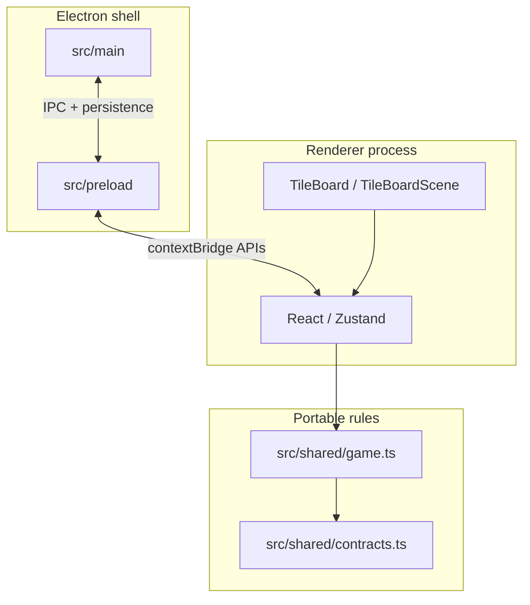

# Architecture (desktop product)

**Product:** Electron shell + Vite/React renderer + TypeScript shared rules. **Authoritative wiring map:** [GAMEPLAY_SYSTEMS_ANALYSIS.md](../GAMEPLAY_SYSTEMS_ANALYSIS.md) (keeps pace with `src/`).

## Layers

- **Turns and scoring** are decided in **`game.ts`**, not in IPC or the main process.
- **IPC** carries settings, save/load, achievements unlock requests, display/window, Steam bridge—not live board protocol.

## Entry points

| Area | Entry | Notes |
|------|--------|------|
| Renderer | `src/renderer/main.tsx` → `App.tsx` | Vite root |
| Main | `src/main/index.ts` | Window, menus, `ipc`, persistence, Steam |
| Preload | `src/preload/index.ts` | Exposes safe APIs to renderer |
| Rules | `src/shared/game.ts` | Pure transitions on `RunState` |

## Local package

- **`packages/notifications`** — Toast/confirm UI (`@cross-repo-libs/notifications`); consumed by renderer; build outputs in `dist/`.

## Related docs

- Stack and scripts: [README.md](../../README.md)
- Tech comparison (historical Expo writeup; see caveats): [LEGACY_AND_CAVEATS.md](./LEGACY_AND_CAVEATS.md)
- Full `src/` inventory: [SOURCE_MAP.md](./SOURCE_MAP.md)
