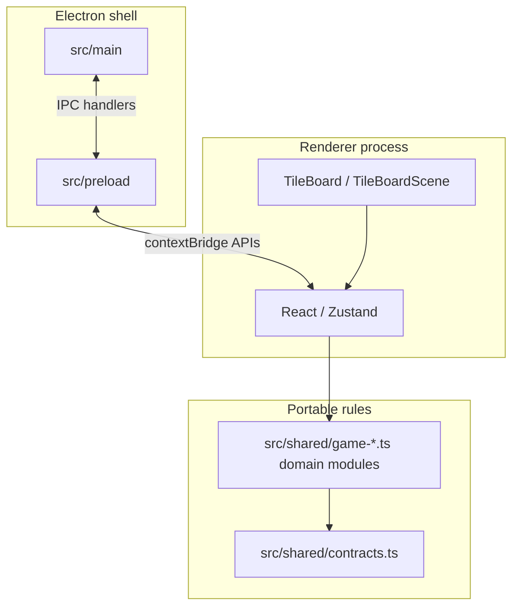

# Architecture (desktop product)

**Product:** Electron shell + Vite/React renderer + TypeScript shared rules. **Authoritative wiring map:** [GAMEPLAY_SYSTEMS_ANALYSIS.md](../GAMEPLAY_SYSTEMS_ANALYSIS.md) (keeps pace with `src/`).

## Layers

- **Turns and scoring** are decided in **`src/shared` gameplay rule modules**, not in IPC or the main process. New work should import from the focused modules (`turn-resolution`, `dungeon-rules`, `board-powers`, etc.); `game.ts` remains a compatibility/backing file during the rules-layer extraction.
- **IPC** carries settings, save/load, achievements unlock requests, display/window, quit, Steam status—not live board protocol. **Persistence** (`electron-store` in `main/persistence.ts`, JSON under the app `userData` dir) runs **only in main**; preload forwards `invoke` calls and does not touch the filesystem.
- **Steam:** `steamworks.js` when init succeeds; otherwise a **mock adapter** (`isConnected` false). Unlock uses the **canonical** channel `steam:unlock-achievement` (legacy alias `desktop:unlock-achievement` is still registered; see [`ipc-channels.ts`](../../src/shared/ipc-channels.ts)). The handler still **persists** the unlock locally before attempting Steam activation.

## Entry points

| Area | Entry | Notes |
|------|--------|------|
| Renderer | `src/renderer/main.tsx` → `initRendererShell.tsx` (`bootstrapWebRenderer`) → `App.tsx` | Vite root; theme + `NotificationHost` + `PlatformTiltProvider` live in `initRendererShell` |
| Main | `src/main/index.ts` | `BrowserWindow`, app lifecycle, IPC registration, `PersistenceService`, Steam adapter (no Electron **Menu** API—the in-app main menu is renderer/React) |
| Preload | `src/preload/index.ts` | Exposes safe APIs to renderer |
| Rules | `src/shared/game-core.ts`, `board-generation.ts`, `turn-resolution.ts`, `board-powers.ts`, `dungeon-rules.ts`, `route-rules.ts`, `shop-rules.ts`, `objective-rules.ts` | Focused pure transitions/helpers on `RunState` and `BoardState`; `game.ts` is the legacy backing module during migration |

## Local package

- **`packages/notifications`** — Toast/confirm UI (`@cross-repo-libs/notifications`); consumed by renderer; build outputs in `dist/`. Details below.

### Notifications (`packages/notifications`)

**Purpose:** Shared toast stack + optional confirm dialogs with a **Zustand store**, an **imperative bridge** for non-React call sites, and a **React host** that renders the DOM and wires the bridge. Pattern is aligned with “MusicalAppReactConcept” (singleton store, `rafDelay` for timed dismiss).

#### Module map

| Module | Role |
|--------|------|
| `src/index.ts` | Public barrel: store factory + default hook, bridge (`notify*` / `setGlobalNotificationHandler`), `NotificationHost` and hooks, `rafDelay`. |
| `src/notificationStore.ts` | `createNotificationStore()` + default **`useNotificationStore`** singleton. State: `notifications[]`, `maxNotifications` (default 5), monotonic ids. API: `addNotification`, `resolveNotification`, `showSuccess` / `showError` / `showWarning` / `showInfo`, `showAchievement`, `confirm` (resolves `boolean`). |
| `src/notificationBridge.ts` | **`notifyError` / `notifyWarning` / `notifySuccess` / `notifyInfo`** delegate to a module-level handler set by the host; if unset, **`configureNotificationFallbackLog`** or `console.*` with `[Notification]` prefix. |
| `src/NotificationHost.tsx` | Renders `.crn-host` region + stacked `.crn-card` items; **`useEffect` registers `setGlobalNotificationHandler`** with store `show*` methods (cleanup sets `null`). Global **Escape** listener dismisses the top confirm dialog. Imports `notification-host.css`. |
| `src/rafDelay.ts` | `requestAnimationFrame`-based delay used to auto-remove non-confirm toasts after `duration`. |

#### Store behavior (high level)

- **Timed toasts:** `duration > 0` and no confirm handlers → `rafDelay` schedules `removeNotification(id)`.
- **Confirm:** `duration` 0, `onConfirm` bundle; resolution via `resolveNotification(id, result)` calls `onConfirm` / `onCancel` once (settlement guard).
- **Stack coalescing:** `meta.stackKey` (or options on `show*`) removes prior rows with the same key before adding (OVR-005-style de-dupe).
- **Cap:** `enforceNotificationLimit` drops oldest **non-confirm** first when over `maxNotifications`; trimmed items get cancel settlement + optional `onDismiss`.
- **Surfaces / a11y:** `NotificationSurface` (`generic` \| `achievement` \| `match-score`), optional `ariaLive` override; host maps type to `role` (`alert` / `status` / `alertdialog`) and live region politeness.

#### Renderer integration

1. **`src/renderer/initRendererShell.tsx`** — Root render wraps `<App />` in **`<NotificationHost>`** (custom `labels` for close button and live region). Imports **`@cross-repo-libs/notifications/styles.css`** (built `notification-host.css`) and global theme vars are applied on `document.documentElement` via `applyRendererThemeToDocument()` before mount. `main.tsx` only invokes `bootstrapWebRenderer()`.
2. **`App.tsx`** — No direct notification imports; toasts are app-wide via the host + shared store.
3. **Styling** — `src/renderer/styles/notificationsGame.css` overrides `.crn-host` / `.crn-card*` using theme CSS variables (position, colors, achievement-specific info styling). Loaded after package styles in `initRendererShell.tsx`.
4. **Call sites** — Example: `GameScreen.tsx` uses **`useNotificationStore.getState()`** for imperative **`showAchievement`** / **`showInfo`** inside effects/handlers (no `notify*` in current `src/` grep; bridge is available for modules that must not import React).

#### Tests

Package ships `*.test.ts(x)` for store, bridge, host, `rafDelay`; renderer tests wrap trees with `NotificationHost` where UI depends on the provider registration.

## Related docs

- Stack and scripts: [README.md](../../README.md)
- Tech comparison (historical Expo writeup; see caveats): [LEGACY_AND_CAVEATS.md](./LEGACY_AND_CAVEATS.md)
- Full `src/` inventory: [SOURCE_MAP.md](./SOURCE_MAP.md)
