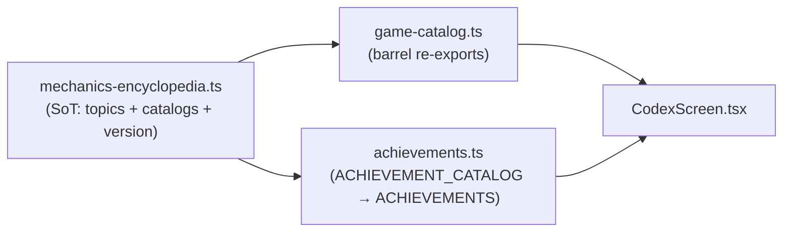

# REF-014 — CodexScreen + mechanics encyclopedia wiring

| Field | Value |
|--------|--------|
| **ID** | REF-014 |
| **Category** | Player reference / UI ↔ data SoT |
| **Priority** | P2 (architecture clarity; behavior already correct) |
| **Status** | Research complete (no code change required for wiring) |

## Summary

**CodexScreen** is a read-only renderer. All encyclopedia topic arrays, relic/mutator catalogs, mode rows, `ENCYCLOPEDIA_VERSION`, and `VISUAL_ENDLESS_MODE_LOCKED` are imported from **`src/shared/game-catalog.ts`**, which **re-exports** definitions from **`src/shared/mechanics-encyclopedia.ts`** (single source of truth for player-facing copy). Achievements in the Codex **table** use **`ACHIEVEMENTS`** from **`src/shared/achievements.ts`**, which itself is backed by **`ACHIEVEMENT_CATALOG`** in the encyclopedia (`ACHIEVEMENT_BY_ID` maps 1:1). **`game-catalog.test.ts`** asserts barrel aliases share the **same object references** as `mechanics-encyclopedia`, preventing silent re-export drops that would desync Codex from the SoT.

## Authoritative stack

- **SoT for strings:** `mechanics-encyclopedia.ts` (`ENCYCLOPEDIA_VERSION`, topic arrays, `RELIC_CATALOG`, `MUTATOR_CATALOG`, `GAME_MODE_CODEX`, `ACHIEVEMENT_CATALOG`, etc.).
- **UI import surface:** `game-catalog.ts` documents that gameplay logic stays elsewhere; Codex should keep pulling encyclopedia exports through this barrel (matches test intent).
- **Achievements:** Copy lives in encyclopedia; `achievements.ts` exposes ordered `ACHIEVEMENTS` for UI and unlock evaluation.

## CodexScreen data map

| UI region | Anchor id | Source | Notes |
|-----------|-----------|--------|--------|
| Core systems | `#codex-core` | `CODEX_CORE_TOPICS` | Via `game-catalog` |
| Powers & tools | `#codex-powers` | `ENCYCLOPEDIA_POWER_TOPICS` | |
| Scoring & survival | `#codex-scoring` | `ENCYCLOPEDIA_SCORING_AND_SURVIVAL_TOPICS` | |
| Settings & assists | `#codex-settings` | `ENCYCLOPEDIA_SETTINGS_AND_ASSISTS_TOPICS` | |
| Pickups & board | `#codex-pickups` | `ENCYCLOPEDIA_PICKUP_AND_BOARD_TOPICS` | |
| Contracts | `#codex-contracts` | `ENCYCLOPEDIA_CONTRACT_TOPICS` | |
| Featured runs | `#codex-featured-runs` | `ENCYCLOPEDIA_FEATURED_RUN_TOPICS` | |
| Game modes | `#codex-modes` | `GAME_MODE_CODEX` + `VISUAL_ENDLESS_MODE_LOCKED` | Synthetic row for locked visual endless |
| Achievements | `#codex-achievements` | `ACHIEVEMENTS` | From `achievements.ts` (encyclopedia-backed) |
| Relics | `#codex-relics` | `RELIC_CATALOG` | Object values rendered in key order |
| Mutators | `#codex-mutators` | `MUTATOR_CATALOG` | Same pattern |

Subtitle shows **v{ENCYCLOPEDIA_VERSION}** from the barrel (same reference as encyclopedia).

## Shell / navigation

- **Menu:** `App.tsx` renders `<CodexScreen />` when `view === 'codex'` and `subscreenReturnView === 'menu'`.
- **In-run desk:** `inGameShellOverlay` portal renders `<CodexScreen stackedOnGameplay />` with `data-codex-context="in-run-desk"` vs `"menu"`.

## Guardrails (tests)

| File | Role |
|------|------|
| `src/shared/game-catalog.test.ts` | Ensures `game-catalog` re-exports point at **identical** arrays/objects as `mechanics-encyclopedia` (explicitly references `CodexScreen` in comment). |
| `src/shared/mechanics-encyclopedia.test.ts` | Topic ID uniqueness, catalog completeness vs `contracts` IDs, version monotonicity. |
| `src/shared/mechanics-catalog-appendix-builder.test.ts` | Appendix output includes `ENCYCLOPEDIA_VERSION`. |

## Optional follow-ups (non-blocking)

1. **Single import path for achievements in Codex:** `CodexScreen` could import `ACHIEVEMENTS` from `game-catalog` (already re-exported) alongside other Codex data—pure consistency/readability.
2. **TOC vs new topic groups:** If a new `ENCYCLOPEDIA_*` array is added to the encyclopedia, **CodexScreen** `TOC` + a new `
` block must be updated manually; there is no codegen—document in PR checklist (already partially covered by `CONTRIBUTING.md` / follow-up docs).

## Code pointers

- `src/renderer/components/CodexScreen.tsx` — composition, tabs, filter, sections.
- `src/shared/game-catalog.ts` — barrel list.
- `src/shared/mechanics-encyclopedia.ts` — SoT + `ENCYCLOPEDIA_VERSION`.
- `src/shared/achievements.ts` — `ACHIEVEMENTS` order + unlock rules.

## Verdict

Wiring is **correct and tested**: Codex consumes encyclopedia data through the intended barrel (plus `achievements` for the achievement list), with reference equality tests preventing accidental barrel regressions. No mandatory engineering task unless product wants import-path polish (follow-up 1).
