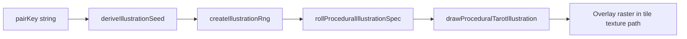

# Procedural illustration architecture

One-page map of how a **pair key** becomes pixels on the card overlay, and how versions and cache keys stay consistent across runtime, tests, bake, and (optionally) future neural-baked assets.

## End-to-end data flow

| Step | Responsibility |
|------|----------------|
| `pairKey` | Game-defined string identifying the tile pair (stable across runs for the same board content). |
| Seed / RNG | Deterministic derivation from `pairKey` (and related inputs) so the same key always rolls the same spec. |
| Spec | Structured parameters for motifs, palettes, stroke density, etc. (`proceduralIllustrationSpec.ts`). |
| Draw | Canvas2D painting in caller space (`drawProceduralTarotIllustration.ts`). |
| Raster integration | [`tileTextures.ts`](../../src/renderer/components/tileTextures.ts) composites the illustration into the static card texture path used by WebGL tiles. |

**Graphics quality → overlay tier:** [`OverlayDrawTier`](../../src/renderer/cardFace/overlayDrawTier.ts) is `'minimal' | 'standard' | 'full'`, mapped from [`GraphicsQualityPreset`](../../src/shared/contracts.ts) via [`overlayDrawTierFromGraphicsQuality`](../../src/renderer/cardFace/overlayDrawTier.ts).

## Cache keys and version stamps

Procedural mode cache keys are built in [`buildProceduralIllustrationCacheKey`](../../src/renderer/cardFace/proceduralIllustration/illustrationCacheKey.ts):

- `pairKey`
- `mode=procedural`
- `tier=<OverlayDrawTier>`
- `illustrationSchemaVersion=<ILLUSTRATION_GEN_SCHEMA_VERSION>`
- `textureVersion=<GAMEPLAY_CARD_VISUALS.textureVersion>`

[`getIllustrationVersionStamp`](../../src/renderer/cardFace/proceduralIllustration/illustrationCacheKey.ts) combines **schema** and **texture** versions into a single `versionToken` string for callers that need a compact invalidation label.

### When to bump what

| Knob | File | Bump when |
|------|------|-----------|
| `ILLUSTRATION_GEN_SCHEMA_VERSION` | [`illustrationSchemaVersion.ts`](../../src/renderer/cardFace/proceduralIllustration/illustrationSchemaVersion.ts) | Roll tables, stroke rules, or anything that changes **deterministic illustration output** for the same inputs. Comment in source: invalidates deterministic outputs. |
| `GAMEPLAY_CARD_VISUALS.textureVersion` | [`gameplayVisualConfig.ts`](../../src/renderer/components/gameplayVisualConfig.ts) | Card-surface / overlay pipeline or caching behavior changes **outside** pure illustration schema (see also comments near texture versioning in [`tileTextures.ts`](../../src/renderer/components/tileTextures.ts)). |

After bumps, expect to refresh **E2E illustration fixtures** (`yarn regenerate:illustration-regression`) when canvas output changes, and to update any **snapshot or appendix** tests that encode catalog counts (unrelated files, but same release discipline).

## Other generation modes (stamps only)

[`illustrationCacheKey.ts`](../../src/renderer/cardFace/proceduralIllustration/illustrationCacheKey.ts) defines stamps for **`drop`** (authored asset id + tier) and **`neural-baked`** (model, prompt hashes, sampler, steps, etc.). Runtime today is primarily **procedural** Canvas2D; the neural key shape is partly exercised in [`illustrationCacheKey.test.ts`](../../src/renderer/cardFace/proceduralIllustration/illustrationCacheKey.test.ts) as a **future-safe** extension point if baked neural textures are wired in later.

## Offline bake and E2E

| Mechanism | Role |
|-----------|------|
| [`scripts/bake-procedural-illustration-set.ts`](../../scripts/bake-procedural-illustration-set.ts) | Headless Chromium: drives the same drawing path and writes PNGs + `manifest.json` under `output/` (ignored by git). Uses fixture pair keys and optional `--tiers=`. |
| Playwright illustration specs | Capture canvas / texture hashes into [`tile-card-face-illustration-regression.json`](../../e2e/fixtures/tile-card-face-illustration-regression.json). |

Bake and E2E both depend on a **stable execution context** (fresh navigation per iteration avoids dev-server HMR destroying the Playwright execution context mid-batch).

## Downstream tooling

[`scripts/card-pipeline/`](../../scripts/card-pipeline/) contains separate asset and capture utilities. Handoffs from procedural bakes (for example trimming PNGs or AI briefs) are **optional** and should stay explicit—see [TASKS.md](./TASKS.md) phase V6.
