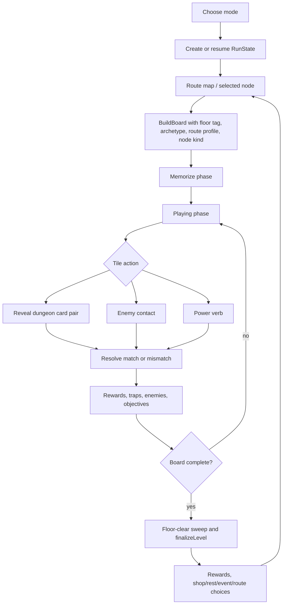
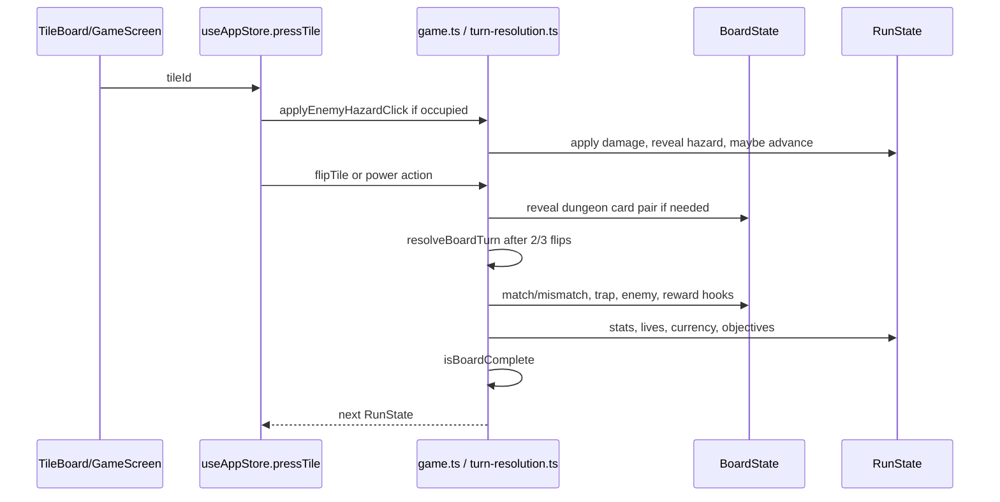
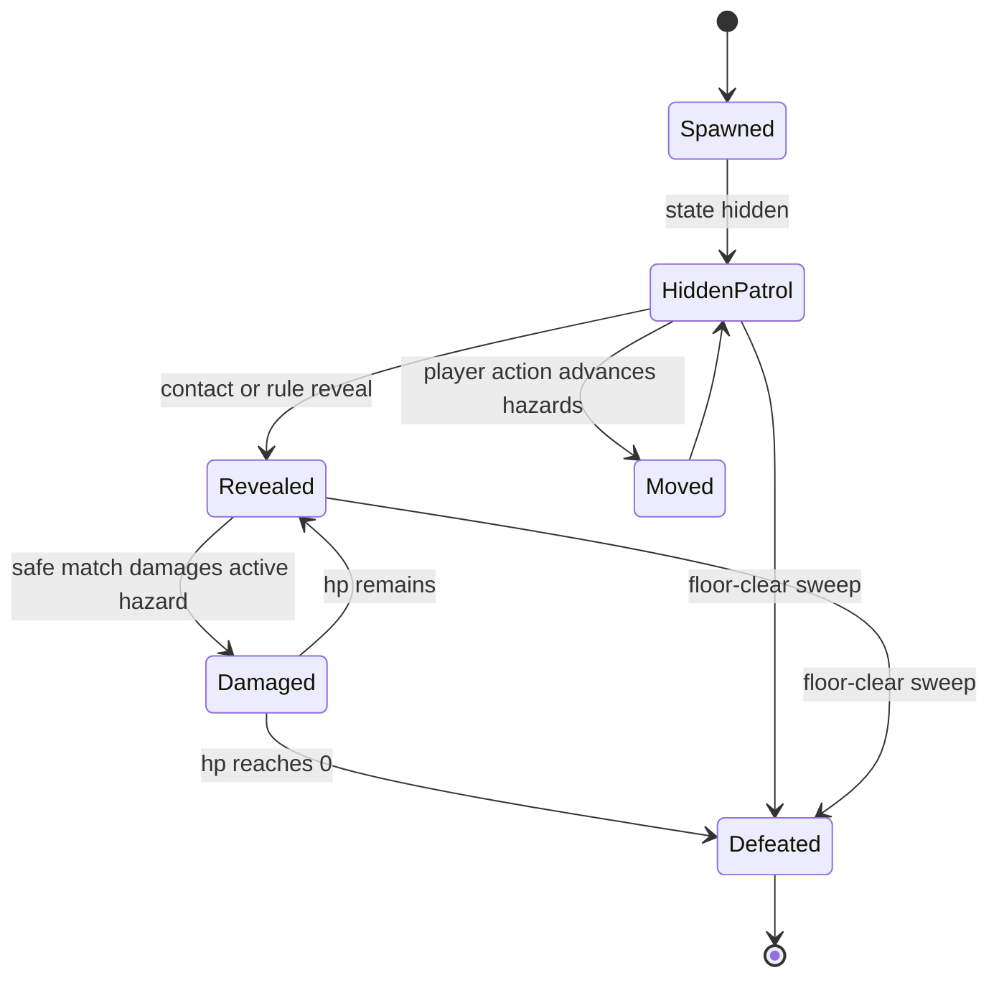
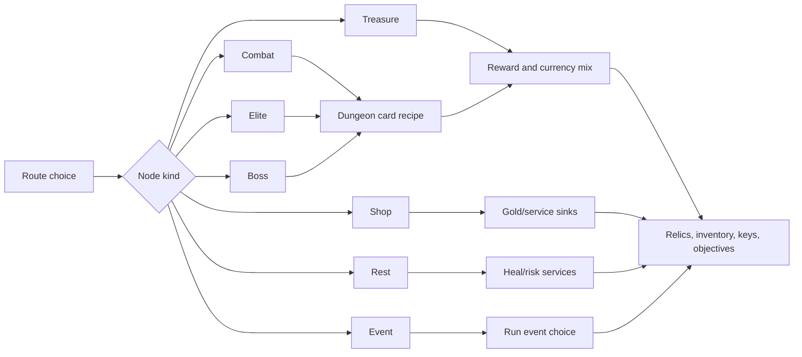
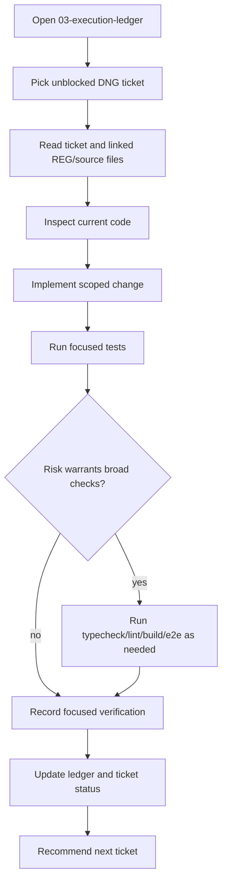

# Dungeon Architecture Diagrams

## Run Lifecycle

```mermaid
flowchart TD
    A[Choose mode] --> B[Create or resume RunState]
    B --> C[Route map / selected node]
    C --> D[BuildBoard with floor tag, archetype, route profile, node kind]
    D --> E[Memorize phase]
    E --> F[Playing phase]
    F --> G{Tile action}
    G --> H[Reveal dungeon card pair]
    G --> I[Enemy contact]
    G --> J[Power verb]
    H --> K[Resolve match or mismatch]
    I --> K
    J --> K
    K --> L[Rewards, traps, enemies, objectives]
    L --> M{Board complete?}
    M -- no --> F
    M -- yes --> N[Floor-clear sweep and finalizeLevel]
    N --> O[Rewards, shop/rest/event/route choices]
    O --> C
```

## Board Resolution Pipeline

```mermaid
sequenceDiagram
    participant UI as TileBoard/GameScreen
    participant Store as useAppStore.pressTile
    participant Rules as game.ts / turn-resolution.ts
    participant Board as BoardState
    participant Run as RunState

    UI->>Store: tileId
    Store->>Rules: applyEnemyHazardClick if occupied
    Rules->>Run: apply damage, reveal hazard, maybe advance
    Store->>Rules: flipTile or power action
    Rules->>Board: reveal dungeon card pair if needed
    Rules->>Rules: resolveBoardTurn after 2/3 flips
    Rules->>Board: match/mismatch, trap, enemy, reward hooks
    Rules->>Run: stats, lives, currency, objectives
    Rules->>Rules: isBoardComplete
    Rules-->>Store: next RunState
```

## Enemy Lifecycle

```mermaid
stateDiagram-v2
    [*] --> Spawned
    Spawned --> HiddenPatrol: state hidden
    HiddenPatrol --> Revealed: contact or rule reveal
    HiddenPatrol --> Moved: player action advances hazards
    Moved --> HiddenPatrol
    Revealed --> Damaged: safe match damages active hazard
    Damaged --> Revealed: hp remains
    Damaged --> Defeated: hp reaches 0
    HiddenPatrol --> Defeated: floor-clear sweep
    Revealed --> Defeated: floor-clear sweep
    Defeated --> [*]
```

## Route And Node Economy

```mermaid
flowchart LR
    RouteChoice[Route choice] --> NodeKind{Node kind}
    NodeKind --> Combat
    NodeKind --> Elite
    NodeKind --> Boss
    NodeKind --> Shop
    NodeKind --> Rest
    NodeKind --> Event
    NodeKind --> Treasure
    Combat --> BoardMix[Dungeon card recipe]
    Elite --> BoardMix
    Boss --> BoardMix
    Treasure --> RewardMix[Reward and currency mix]
    Shop --> Sinks[Gold/service sinks]
    Rest --> Recovery[Heal/risk services]
    Event --> Choice[Run event choice]
    BoardMix --> RewardMix
    RewardMix --> Builds[Relics, inventory, keys, objectives]
    Sinks --> Builds
    Recovery --> Builds
    Choice --> Builds
```

## Future-Agent Loop

```mermaid
flowchart TD
    A[Open 03-execution-ledger] --> B[Pick unblocked DNG ticket]
    B --> C[Read ticket and linked REG/source files]
    C --> D[Inspect current code]
    D --> E[Implement scoped change]
    E --> F[Run focused tests]
    F --> G{Risk warrants broad checks?}
    G -- yes --> H[Run typecheck/lint/build/e2e as needed]
    G -- no --> I[Record focused verification]
    H --> I
    I --> J[Update ledger and ticket status]
    J --> K[Recommend next ticket]
```

