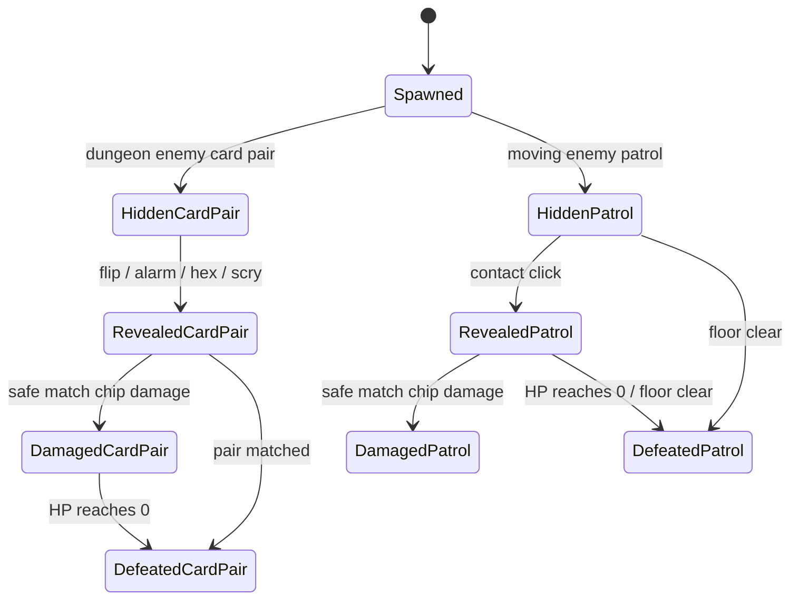

# Enemy Lifecycle Contract

## Status
Implemented by `DNG-030`.

## Vocabulary
- Enemy card pair: a matched pair with `dungeonCardKind: 'enemy'`. It has pair-shared HP and is defeated by matching the pair or by safe-match chip damage while revealed.
- Moving enemy patrol: an `EnemyHazardState` overlay. It occupies board tiles, moves after actions, damages on contact, and can be defeated by safe-match chip damage or floor clear.
- Boss enemy: either an enemy card pair with `dungeonBossId` or a moving enemy patrol with `bossId`.

## State Diagram

## Counter Contract
- `dungeonEnemiesDefeatedThisFloor` counts defeated enemy card pairs and defeated boss patrols for objective progress.
- `enemyHazardsDefeatedThisFloor` counts moving enemy patrol overlays defeated by damage or floor clear.
- `getDungeonEnemyLifecycleStatus` is the shared read model for enemy card pair counts, moving patrol counts, boss activity, and vocabulary-safe copy.
